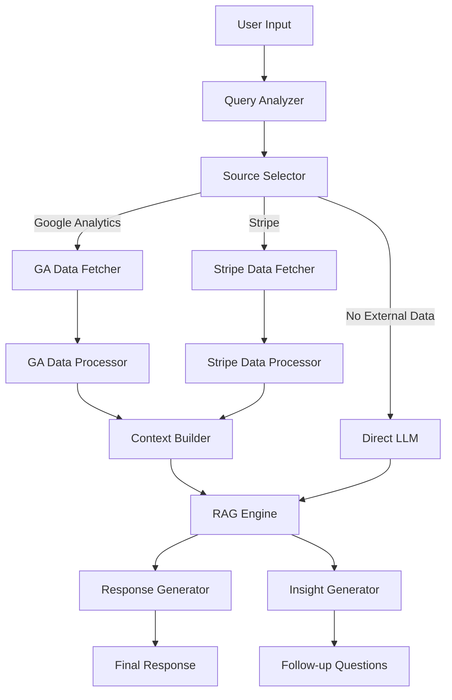

# Marketing Analytics Assistant

A powerful, modular system for analyzing business metrics from multiple data sources (Google Analytics/Stripe) using natural language queries.

## Workflow Diagram



## Installation

### Prerequisites

- Python 3.11+ recommended
- An Ollama installation for running local LLMs

### Setup

1. Clone the repository:
   ```bash
   git clone https://github.com/yourusername/financial_assistant.git
   cd financial_assistant
   ```

2. Create and activate a virtual environment:
```
   python -m venv venv
source venv/bin/activate  # On Windows: venv\Scripts\activate
```
3. Install dependencies:
```
bashpip install -r requirements.txt
```
4. Start Ollama in a separate terminal:
``` bashollama serve ```

5. Pull required models:
``` bashollama pull mistral:7b  # or another model of your choice ```


6. Configuration
```
Create a .env file in the project root (or copy and modify .env.template):
# API Credentials (for production use)
GOOGLE_ANALYTICS_KEY_PATH=path/to/your/credentials.json
STRIPE_API_KEY=your_stripe_key

# Model Configuration
OLLAMA_BASE_URL=http://localhost:11434
OLLAMA_MODEL=mistral:7b
```
7. Usage
```
Run the main application:
bashpython -m financial_assistant.main
```

## Example queries:

- "What was my conversion rate last month compared to the previous month?"
- "Show me revenue by product category from Stripe for Q1"
- "What's the average order value from Stripe and how has it changed over the last 30 days?"
